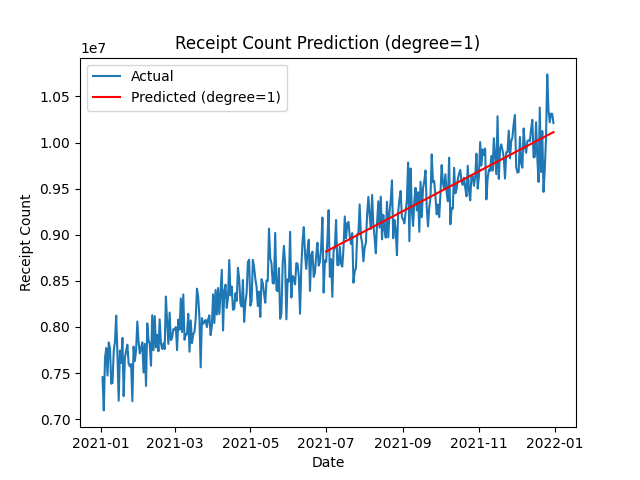
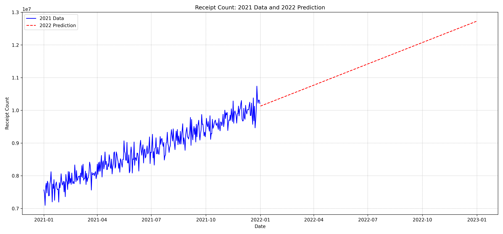
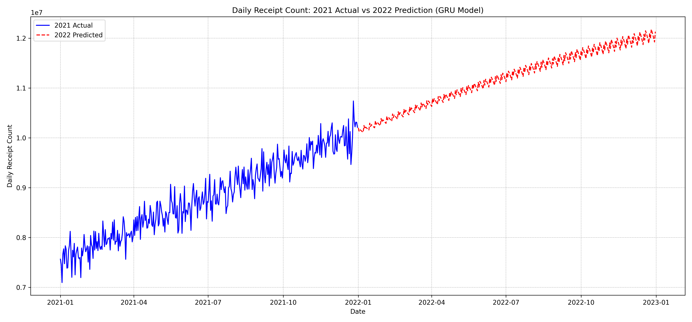

# Fetch Rewards ML Take Home Assignment

> "Simplicity is the ultimate sophistication." - Leonardo da Vinci

## Objective
```
The following link provides the number of the observed scanned receipts each day for the year 2021. Based on this prior knowledge, please develop an algorithm which can predict the approximate number of the scanned receipts for each month of 2022.


Expected Delivery

- You are expected to build an ML model from scratch to address this challenge. Your solution can be simple or complex. You are allowed to develop your solution using any languages and frameworks like PyTorch or Tensorflow. But please note that we would like to use your solution to understand your ML knowledge base. So please avoid from using any high level libraries like scikit-learn which makes it impossible to exhibit your ML skills.
- Additionally, you are expected to build up a small app which will run an inference procedure against your own trained model and return the predicted results. You are free to build up any form of app like a web service or so but having user interaction and some sort of visualization will be a plus.
- If possible, please package your app in a Docker container that can be built and run locally or pulled down and run via Docker Hub.
- Please assume the evaluator does not have prior experience executing programs in your chosen language. Therefore, please include any documentation necessary to accomplish the above requirements.
- The code, at a minimum, must run. Please provide clear instructions on how to run it.
- When complete, please upload your codebase to a public Git repo (GitHub, Bitbucket, etc.) and email us the link. Please double-check this is publicly accessible.
```

## Approach

### Methodology

To predict the 2022 monthly receipts, I trained 2 models to predict the daily receipts for the year 2022, then aggregated the daily predictions to get the monthly predictions. I used a linear regression model and a Gated Recurrent Units (GRU) model to predict the daily receipts for 2022. The linear regression model is a simple model that fits a linear relationship between the date and the receipts, while the GRU model is a more complex neural network model that can capture temporal patterns and dependencies in the data. I evaluated the performance of both models on the 2021 data and selected both model to make the predictions for 2022.

My solution considers that the training dataset given is not the only dataset that could be used. My solution allows a user to provide a dataset in the same format as the training dataset to train the model. The user can then use the trained model to make predictions on the provided dataset. The model will then make predictions for each month in 2022. Using 2 models allows the user to compare the predictions made by the linear regression model and the GRU model and select the model that best fits the data.

### Data Preprocessing

- The data is stored in a CSV file with two columns: `date` and `receipts`.
- The `date` column is of type `datetime64[ns]` and the `receipts` column is of type `int64`.
- The data is loaded into a pandas DataFrame and the `date` column is set as the index.
- Feature engineering is performed to extract the values for IsWeekend, DayOfWeek, and IsHoliday.
- The IsWeekend column is of type `bool`, the DayOfWeek column is `int64` and the `IsHoliday` column is of type `bool`

### Model Development

- I experimented with various models simple linear regression, polynomial regression, and GRU based models.
- The best results were obtained using a simple linear regression model.
- The next best performing model was a Gate Recurrent Units (GRU) based model.
- Why GRU? 
    - GRU are particularly well-suited for time series data due to their ability to capture long-term dependencies and temporal patterns. GRUs can effectively learn and remember important information over extended sequences, making them ideal for predicting trends in time-based data like daily receipts. Additionally, GRUs are computationally efficient and can handle varying sequence lengths, making them a versatile choice for diverse time series prediction tasks. Compared to LSTM models, GRUs have a simpler structure with fewer parameters, which can lead to faster training and reduced risk of overfitting, especially on smaller datasets, while still maintaining comparable performance in many time series applications.

### Model Evaluation

- To evaluate these different models, I split the 2021 in half. Half for training, half for evaluation.
- These are my preliminary results

Linear Model



Quadratic Model


Cubic Model


GRU Model


### 2022 Predictions
Linear Model



GRU Model



More results can be found in the outputs folder.
My tests can also be found in the python files in the [tests](./preliminary_testing) folder.

## App Development

- I developed a simple web app using Flask to run an inference procedure against the trained model and return the predicted results.
- The app allows the user to upload a dataset in the same format as the training dataset and train the model on the provided dataset.
- The user can then make predictions for each month in 2022 using the trained models.
- The app provides a simple visualization of the predicted daily and monthly receipts for 2022 using plotly.
- The app is packaged in a Docker container that can be built and run locally or pulled down and run via Docker Hub.

## Running the App

### Prerequisites

- Python 3.8 or higher
- Docker

### Running the App Locally

1. Clone the repository

```bash
git clone
```

2. Change into the directory

```bash
cd fetch_rewards_ml_take_home_assignment
```

3. Build the Docker container

```bash
docker build -t fetch-rewards-ml-app .
```

4. Run the Docker container

```bash
docker run -p 8001:8001 fetch-rewards-ml-app
```

5. Open a web browser and go to `http://localhost:8001` to access the app

### Running the App from Docker Hub

1. Pull the Docker container from Docker Hub

```bash
docker pull
```

2. Run the Docker container

```bash
docker run -p 8001:8001 fetch-rewards-ml-app
```

3. Open a web browser and go to `http://localhost:8001` to access the app

## Conclusion

In conclusion, I developed a simple ML model to predict the approximate number of scanned receipts for each month of 2022 based on the observed scanned receipts each day for the year 2021. I trained a linear regression model and a GRU model to predict the daily receipts for 2022 and aggregated the daily predictions to get the monthly predictions. I developed a web app using Flask to run an inference procedure against the trained model and return the predicted results. The app allows the user to upload a dataset in the same format as the training dataset, train the model on the provided dataset, and make predictions for each month in 2022 using the trained models. The app provides a simple visualization of the predicted daily and monthly receipts for 2022 using plotly. The app is packaged in a Docker container that can be built and run locally or pulled down and run via Docker Hub.


